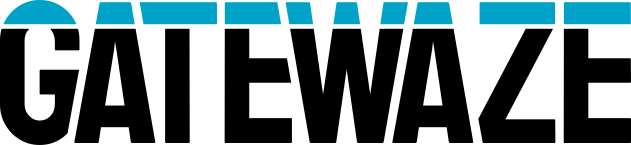

<p align="center">
  <picture>
    <source media="(prefers-color-scheme: dark)" srcset="docs/assets/gatewaze-logo-white.svg">
    <source media="(prefers-color-scheme: light)" srcset="docs/assets/gatewaze-logo-black.svg">
    
  </picture>
</p>

<p align="center">
  <a href="https://opensource.org/licenses/Apache-2.0"></a>
</p>

**The AI-native open-source platform for communities.**

Gatewaze is a modular, open-source platform for managing communities and the people in them: members, events, content, newsletters, sites, and communications. You assemble it from modules, and each module is a self-contained mini-application that can ship its own admin UI, API routes, background jobs, database migrations, and public-facing portal pages out of the box. Turn on the pre-built modules you need, and build your own for anything else. AI is built in too, so you can ship AI features to production on your own infrastructure without a separate AI platform.

**Proven in production.** Gatewaze runs a developer community of 155k+ members, with 58k+ newsletter subscribers and 76k+ meetup attendees.

---

## Features

- **Modular by Design** -- Every capability is a self-contained module: admin UI, API routes, background jobs, database migrations, and public-facing portal pages, all auto-discovered and individually toggleable. Use the pre-built modules, or build your own for anything your community needs.
- **People & Member Management** -- Manage profiles, organizations, membership tiers, and track engagement across your community.
- **Admin Dashboard & Public Portal** -- A full-featured React admin interface and a fast, SEO-friendly Next.js public portal.
- **Run AI in Production** -- A built-in AI runtime with one provider router for OpenAI, Anthropic, and Google Gemini; an embeddable, streamed chat widget; per-user and per-use-case credentials; model allow-lists; a per-call cost ledger; and hard budget caps. Ship AI features on your own infrastructure, with no separate AI platform required.
- **Bring Your Own Agent** -- Author a [Goose](https://github.com/aaif-goose/goose) recipe locally and run it *unchanged* in production. Gatewaze runs Goose, Block's open-source agent runtime, as a server-side CLI, so there's no rewrite, no serverless wrapper, and no local-to-cloud translation.
- **MCP Server Library** -- Expose your platform to AI agents through bundled [Model Context Protocol](https://modelcontextprotocol.io) (MCP) servers: platform data (events, speakers, sponsors, health), a whitelisted API proxy, and a headless browser (local Chromium or [Browserbase](https://www.browserbase.com)).
- **Agent Memory** -- A durable, git-synced knowledge base for agents based on [Andrej Karpathy's LLM Wiki](https://gist.github.com/karpathy/442a6bf555914893e9891c11519de94f) design: immutable raw sources distilled into LLM-authored, cross-linked wiki pages with full-text and vector search.
- **Automation** -- A headless browser for agents, a governed web-fetch API (quotas, domain rules, robots.txt, audit and billing ledger), and a scraper system backed by a fetch service built on [Scrapling](https://github.com/D4Vinci/Scrapling), with eight swappable residential-proxy providers.
- **Configurable Authentication** -- Supports Supabase Auth and OIDC providers for flexible identity management.
- **Email & Messaging** -- Transactional and bulk email via SendGrid or any SMTP provider, plus Slack, SMS, and WhatsApp through modules.
- **Self-Host Anywhere** -- Start in minutes with Docker Compose, then run in production on Kubernetes with the bundled Helm chart. No SaaS lock-in; nothing leaves your cluster.

## Modules

Gatewaze's module system lets you pick the capabilities you need. Modules are selected during onboarding and can be enabled or disabled at any time.

The official open-source module collection lives in the [gatewaze-modules](https://github.com/gatewaze/gatewaze-modules) repository: **86 modules**, all Apache-2.0, spanning events, content, people and community, sites and web, marketing, communications, integrations, and platform infrastructure. Examples include event registrations, calendars, speakers, newsletters, blog, a multi-site web builder, forms, surveys, Stripe payments, Slack, SMS and WhatsApp messaging, analytics, AI, and compliance.

A fresh install points at that repository already, so all 86 show up on the Modules page the first time you open the admin. You choose which ones to turn on during setup, and you can change your mind at any time.

You can also create your own modules and load them from local paths, git repos, or uploaded packages. See the [Module System Guide](./docs/modules.md) for full documentation on creating and managing modules.

## Tech Stack

| Layer          | Technology                          |
|----------------|-------------------------------------|
| Admin App      | React + Vite                        |
| Public Portal  | Next.js                             |
| API Server     | Express                             |
| Database       | PostgreSQL via [Supabase](https://supabase.com) |
| Auth           | [Supabase](https://supabase.com) Auth / OIDC |
| Storage        | Supabase Storage                    |
| Edge Functions | Supabase Edge Functions (Deno)      |
| Job Queue      | [Redis](https://redis.io) + [BullMQ](https://bullmq.io) |
| AI             | OpenAI · Anthropic · Gemini (unified router) |
| Agents         | [Goose](https://github.com/aaif-goose/goose) (server-side CLI) + [MCP](https://modelcontextprotocol.io) |
| Scraping       | [Scrapling](https://github.com/D4Vinci/Scrapling) fetch service + residential proxies |
| Analytics      | [Umami](https://umami.is) (self-hosted)     |
| UI Components  | Radix Themes + Tailwind CSS         |
| Deployment     | Docker Compose / Kubernetes + Helm  |
| Package Manager| pnpm (monorepo workspaces)          |

## Architecture

```
                       Browsers, and AI agents
                                 |
                +----------------+-----------------+
                |  Traefik (local) or your         |
                |  ingress controller (Kubernetes) |
                +--+--------+---------+--------+---+
                   |        |         |        |
            +------v---+ +--v-------+ |  +-----v--------+
            |  admin   | |  portal  | |  |  mcp-public  |
            |  React   | | Next.js  | |  |  read-only   |
            +----+-----+ +----+-----+ |  |  MCP for     |
                 |            |       |  |  AI agents   |
                 |            |  +----v--+--+  +--------+
                 |            |  |   api    |
                 |            |  | Express  |
                 |            |  +--+----+--+
                 |            |     |    |
       +---------v------------v-----v-+  |  +--------------+
       |          Supabase            |  +->|    redis     |
       |  Postgres . Auth . Storage   |     |  job queues  |
       |  PostgREST . Realtime        |     +--+--------+--+
       |  Edge Functions . Kong       |        |        |
       +------------------------------+  +-----v---+ +--v---------+
                                         |scheduler| |   worker   |
                                         |  cron   | | + Chromium |
                                         +---------+ +-----+------+
                                                           |
   optional:  se-runner . scrapling-fetcher . events-mcp . browser-mcp
              umami analytics
```

The scheduler puts jobs on the queue and does no work itself. The worker takes
them off and runs them. [Architecture](./docs/architecture.md) draws the full
stack and explains what each service is for.

## Quick Start

### Prerequisites

- [Docker](https://www.docker.com/) and Docker Compose (v2.20+)
- [GNU Make](https://www.gnu.org/software/make/) (pre-installed on macOS and most Linux distributions)

That's it for running with Docker. For development from source, you also need:
- [Node.js](https://nodejs.org/) >= 20
- [pnpm](https://pnpm.io/) >= 9

### Get Your First Environment Running

```bash
# Clone the repository
git clone https://github.com/gatewaze/gatewaze.git
cd gatewaze

# Create your environment config from the example
make init

# Start everything
make up
```

The first run takes several minutes, because it builds the images and the
database applies every migration as it starts. Check on it with:

```bash
make ps
```

One thing worth knowing before you run this. It starts about 23 containers:
the Gatewaze services, a complete self-hosted Supabase, Redis, and the
supporting services. Give Docker roughly 8 GB of memory.

### Everyday Commands

| Command        | Description                                          |
|----------------|------------------------------------------------------|
| `make up`      | Start all services (dev mode with hot reload)        |
| `make down`    | Stop all services                                    |
| `make reset`   | Stop, remove all volumes, and restart fresh          |
| `make logs`    | Tail service logs (Ctrl-C to stop)                   |
| `make ps`      | Show running containers                              |
| `make help`    | Show all available commands                          |

### Multi-Brand Setup

If you run more than one brand from the same checkout, keep the per-brand env
files in a sibling directory called `gatewaze-environments`. The Makefile looks
for them there.

```
parent-directory/
  gatewaze/               # this repo
  gatewaze-environments/  # your own repo, holding one env file per brand
    brand1.local.env
    brand2.local.env
```

That sibling directory is yours to create. It is not a repository we publish.

Then pass the brand name before the command:

```bash
make brand1 up        # Start the "brand1" brand
make brand1 down      # Stop the "brand1" brand
make brand1 reset     # Reset the "brand1" brand
make brand2 up        # Start a different brand
```

### Access the Services

Services are accessible via Traefik `.localhost` domains (resolve automatically per RFC 6761) and via direct ports:

| Service          | Traefik URL                         | Direct Port               |
|------------------|-------------------------------------|---------------------------|
| Admin App        | http://admin.gatewaze.localhost     | http://localhost:5274      |
| Public Portal    | http://app.gatewaze.localhost       | http://localhost:3100      |
| API Server       | http://api.gatewaze.localhost       | http://localhost:3002      |
| Supabase API     | http://supabase.gatewaze.localhost  | http://localhost:54321     |
| Supabase Studio  | http://studio.gatewaze.localhost    | http://localhost:54323     |
| PostgreSQL       | --                                  | localhost:54322            |
| Traefik Dashboard| --                                  | http://localhost:8080      |

### First run

There is no default administrator account. Open the admin at
http://admin.gatewaze.localhost or http://localhost:5274 and Gatewaze walks you
through a setup wizard: name your platform, create your administrator account,
choose which modules to turn on, and pick a theme.

If email is not configured yet, the wizard signs you in directly. If it is, it
emails you a sign-in link, and on a self-hosted Supabase you can read that link
in Supabase Studio at http://studio.gatewaze.localhost under **Authentication**.

Before you point a public hostname at an instance, read the security note in
[Getting Started](./docs/getting-started.md#a-security-note-before-you-expose-this).

### Supabase Cloud

To use [Supabase Cloud](https://supabase.com) instead of self-hosted, set
`SUPABASE_MODE=cloud` in `docker/.env` along with `SUPABASE_PROJECT_REF`,
`SUPABASE_URL`, `ANON_KEY`, `SERVICE_ROLE_KEY`, and `DATABASE_URL`. Then:

```bash
make up                  # starts the application services only
make migrate             # pushes migrations to the linked project
make deploy-functions    # deploys edge functions and syncs their secrets
```

### Kubernetes

```bash
helm repo add gatewaze https://gatewaze.github.io/gatewaze
helm repo update

cp helm/examples/values-supabase-cloud.yaml my-values.yaml
# edit my-values.yaml and replace every CHANGE ME

helm install gatewaze gatewaze/gatewaze \
  --namespace gatewaze --create-namespace \
  -f my-values.yaml
```

See [docs/kubernetes.md](./docs/kubernetes.md) for the full guide, three worked
example values files, resource sizing, and what each image does.

---

## Development from Source

For contributing or local development without Docker for the app services:

```bash
# Install dependencies
pnpm install

# Start infrastructure (Supabase + Redis) via Docker
cd docker
docker compose up -d supabase-db supabase-auth supabase-rest supabase-kong supabase-storage supabase-realtime supabase-edge-functions redis
cd ..

# Start all dev servers
pnpm dev
```

| Service | URL |
|---|---|
| Admin app | http://localhost:5173 |
| Public portal | http://localhost:3100 |
| API server | http://localhost:3002 |

See [docs/development.md](./docs/development.md) for the full development setup guide.

---

## Project Structure

```
gatewaze/
  Makefile            # Everyday commands: make up, make down, make reset
  gatewaze.config.ts  # Instance config: module sources, auth, email
  packages/
    admin/            # React + Vite admin application
    portal/           # Next.js public portal
    api/              # Express API server, BullMQ worker, and scheduler
    shared/           # Shared types, module loader, module lifecycle
    tracking/         # Engagement tracking used by portal and admin
    mcp/              # MCP server for AI agents (public and keyed profiles)
    api-mcp/          # MCP server proxying whitelisted platform API calls
    events-mcp/       # Internal MCP server for the events tools
    browser-mcp/      # Internal MCP server giving agents a headless browser
    connect/          # CLI that connects a user's AI clients to your MCP server
  supabase/
    migrations/       # Database migrations, applied on first startup
    functions/        # Supabase Edge Functions (Deno)
  docker/
    docker-compose.yml            # Full stack, self-hosted Supabase
    docker-compose.cloud.yml      # App services only, Supabase Cloud
    docker-compose.quickstart.yml # Pre-built images, no build step
    docker-compose.dev.yml        # Hot-reload overrides, added by make up
    .env.example                  # Docker environment configuration
  helm/
    gatewaze/         # Kubernetes Helm chart
    examples/         # Worked values files to copy and edit
  docs/               # Project documentation
```

## Documentation

Detailed documentation is available in the [`docs/`](./docs) directory:

- [Getting Started](./docs/getting-started.md) -- install it and set it up
- [Architecture Overview](./docs/architecture.md) -- what runs where, and why
- [Configuration Guide](./docs/configuration.md) -- every setting and environment variable
- [Deployment Guide](./docs/deployment.md) -- Docker Compose in production
- [Kubernetes](./docs/kubernetes.md) -- the Helm chart, example values, and sizing
- [Module Development](./docs/modules.md) -- use the modules, or write your own
- [Authentication](./docs/auth.md) -- Supabase Auth, OIDC, and permissions
- [Development](./docs/development.md) -- work on Gatewaze itself

## Contributing

We welcome contributions from the community! Please read our [Contributing Guide](./CONTRIBUTING.md) before getting started.

Key points:

- You must sign the [Contributor License Agreement](./CLA.md) before your first PR is merged.
- Follow [Conventional Commits](https://www.conventionalcommits.org/) for commit messages.
- All code must be written in TypeScript and pass linting, type checking, and tests.

## License

Gatewaze is licensed under the [Apache License 2.0](./LICENSE).

```
Copyright 2026 Gatewaze Contributors

Licensed under the Apache License, Version 2.0 (the "License");
you may not use this file except in compliance with the License.
You may obtain a copy of the License at

    http://www.apache.org/licenses/LICENSE-2.0

Unless required by applicable law or agreed to in writing, software
distributed under the License is distributed on an "AS IS" BASIS,
WITHOUT WARRANTIES OR CONDITIONS OF ANY KIND, either express or implied.
See the License for the specific language governing permissions and
limitations under the License.
```

See [NOTICE](./NOTICE) for third-party attributions and [TRADEMARK.md](./TRADEMARK.md) for trademark usage policy.

## Built With

Gatewaze is made possible by these outstanding open-source projects:

- [Supabase](https://supabase.com) -- The open-source Firebase alternative powering our database, auth, storage, and edge functions.
- [React](https://react.dev) -- The library behind the admin interface.
- [Next.js](https://nextjs.org) -- The framework powering the public event portal.
- [Vite](https://vitejs.dev) -- Fast build tooling for the admin app.
- [Express](https://expressjs.com) -- The API server framework.
- [BullMQ](https://bullmq.io) -- Reliable job queue for background processing.
- [Radix Themes](https://www.radix-ui.com/themes) -- Beautiful, accessible UI components.
- [Tailwind CSS](https://tailwindcss.com) -- Utility-first CSS framework.
